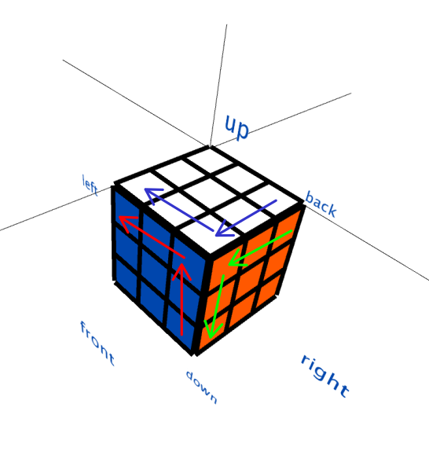

# API

## API name

* surface name:
    * up
    * down
    * front
    * back
    * left
    * right
* distance:
    * 1
    * 2
    * 3

In our API, API name = \<surface name\>\<distance with layer\>_\<Counterclockwise | clockwise\>.

## clockwise rotate:

|command|equivalent command|description|
|:-:|:-:|:-:|
|up1_clockwise |down3_clockwise||
|up2_clockwise |down2_clockwise ||
|up3_clockwise |down1_clockwise ||
|front1_clockwise |back3_clockwise ||
|front2_clockwise |back2_clockwise ||
|front3_clockwise |back1_clockwise ||
|right1_clockwise |left3_clockwise ||
|right2_clockwise |left2_clockwise ||
|right3_clockwise |left1_clockwise ||

## counter clockwise rotate

|command|equivalent command|description|
|:-:|:-:|:-:|
|up1_Counterclockwise |down3_Counterclockwise||
|up2_Counterclockwise |down2_Counterclockwise ||
|up3_Counterclockwise |down1_Counterclockwise ||
|front1_Counterclockwise |back3_Counterclockwise ||
|front2_Counterclockwise |back2_Counterclockwise ||
|front3_Counterclockwise |back1_Counterclockwise ||
|right1_Counterclockwise |left3_Counterclockwise ||
|right2_Counterclockwise |left2_Counterclockwise ||
|right3_Counterclockwise |left1_Counterclockwise ||

## rotate all cube

|command|description|
|:-:|:-:|
|up_right|右翻|
|up_left|左翻|
|up_back|上翻|
|up_front|下翻|
|up_fix_right|右轉翻|
|up_fix_left|左轉翻|
